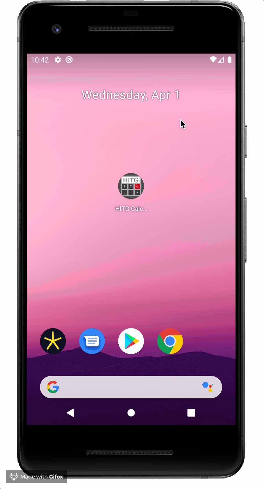

## Calculator HITG

**Calculator with basic operations and simple memory. Lightweight and easy to use.**

This calculator is designed to be simple and free of advertisements.
It has only the basic operations of addition, subtraction, multiplication, and division.
You can also calculate the percentage and square root.
The current maximum precision is 8 digits, enough for day-to-day operations, but soon it will have settings to increase accuracy and display more digits.

To make an operation, simply enter the first number, then one of the four basic operators and then the second number and equal to display the result.

If the calculation has more than two values, use the equal sign at the end of the operation only.

After each operation, the total value will be displayed on the screen.

If you want to continue using the answer of the previous operation as input to the next calculation, just type the desired operator and continue calculating.

The memory works as follows:
M+ adds the value that is on the screen or the result of an account not yet finalized in memory adding to the previous value in memory.
M- works the same way but subtracting the value of the screen from the value already in memory.
MRC retrieves the memory value to be used in a new operation and clears the memory.

The percentage is calculated from the previously entered number within the same operation.

The Square Root shows in the display the result of the square root of the number in the display.

The +/- button inverts the signal number of the number in the display.

Some examples of use:

42 + 25 =
On-screen result 67

190.2 × 3 =
On-screen result 570.6

120 + 10%
Result on the screen 12 +
12 represents 10% of 120. Note that the + sign is still displayed on the screen, showing that the operation has not yet been completed, to realize the sum it is necessary to touch the equal sign.
On-screen result 132

25 × Root (9)
Screen result 3 ×
3 represents the Root of 9. Note that the × sign is still displayed on the screen, demonstrating that the operation has not yet been completed, to carry out the multiplication, it is necessary to touch the equal sign.
On-screen result 75

Memory usage.
To make the following account:
(12 × 3) + (132 ÷ 2)
do it:
12 × 3 M+ 132 ÷ 2 M + MRC
On-screen result 102

[Privacy policy](privacy_policy.md)

**Available in: [Google Play - Calculator HITG](https://play.google.com/store/apps/details?id=br.com.hitg.calculator "Calculator HITG")**

